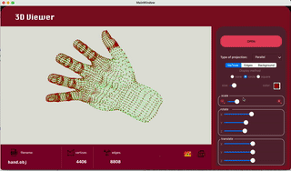

# 3dViewerCPP_Qt

В данном проекте на языке программирования С++ в парадигме объектно-ориентированного программирования реализовано приложение для визуализации каркасной модели в трехмерном пространстве. Каркасная модель - модель объекта в трёхмерной графике, представляющая собой совокупность вершин и рёбер, которая определяет форму отображаемого многогранного объекта в трехмерном пространстве.
Модели загружаются из файлов формата .obj. Их возможно просматривать на экране с возможностью вращения, масштабирования и перемещения. Применяются собственные матрицы афинных преобразований (вращения, масштабирования и перемещения).

### Интерфейс

### Реализация

- Программа разработана на языке C++ стандарта C++17;
- Код соответствует Google Style;
- Сборка программы настроена с помощью Makefile со стандартным набором целей для GNU-программ: all, install, uninstall, clean, dvi, dist, tests. Установка ведётся в каталог build в директории проекта;
- Программа разработана в соответствии с принципами объектно-ориентированного программирования;
- Обеспечено полное покрытие unit-тестами модулей, связанных с загрузкой моделей и аффинными преобразованиями;
- В один момент времени может быть только одна модель на экране;
- Программа предоставляет возможность:
    - Загружать каркасную модель из файла формата obj (поддержка только списка вершин и поверхностей);
    - Перемещать модель на заданное расстояние относительно осей X, Y, Z;
    - Поворачивать модель на заданный угол относительно своих осей X, Y, Z;
    - Масштабировать модель на заданное значение;
- В программе реализован графический пользовательский интерфейс, на базе фреймворка Qt;
- Графический пользовательский интерфейс содержит:
    - Кнопку для выбора файла с моделью;
    - Зону визуализации каркасной модели;
    - Ползунок для перемещения модели;
    - Ползунок для поворота модели;
    - Ползунок для масштабирования модели; 
    - Информацию о загруженной модели - название файла, кол-во вершин и ребер;
- Программа обрабатывает и позволяет пользователю просматривать модели с деталями до 1 000 000 вершин без зависания;
- Программа реализована с использованием паттерна MVC, то есть:
    - отсутствует код бизнес-логики в коде представлений;
    - отсутствует код интерфейса в контроллере и в модели;
    - контроллер - тонкий;
- Использованы следующие паттерны проектирования: фасад, стратегия и синглтон;
- Классы реализованы внутри пространства имен `viewer`.

- Программа позволяет настраивать тип проекции (параллельная и центральная);
- Программа позволяет настраивать:
    - тип (сплошная, пунктирная), цвет и толщину рёбер,
    - способ отображения (отсутствует, круг, квадрат), цвет и размер вершин;
- Программа позволяет выбирать цвет фона;
- Настройки сохраняются между перезапусками программы.
 
- Программа позволяет сохранять полученные («отрендеренные») изображения в файл в форматах bmp и jpeg;
- Программа позволяет по специальной кнопке записывать небольшие «скринкасты» - текущие пользовательские аффинные преобразования загруженного объекта в gif-анимацию (640x480, 10fps, 5s).

 

---

Над проектом работала команда в составе:

- [Маргарита](https://github.com/Marg-S)
- [Ильнар](https://github.com/monterys)
- [Даниль](https://github.com/brcarisa)
