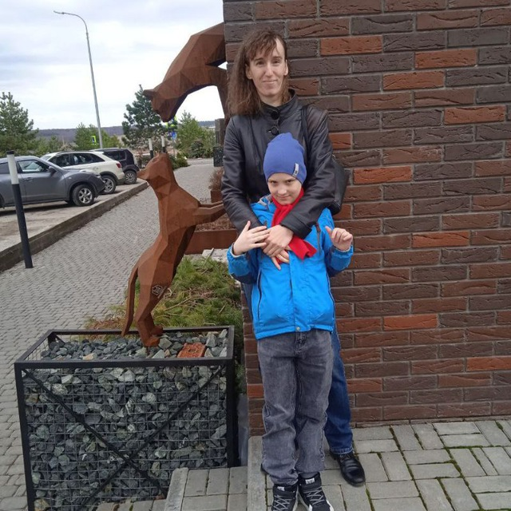

# 3DViewer v2.0
## Реализация на языке программирования С++ в парадигме объектно-ориентированного программирования приложение для просмотра 3D моделей в каркасном виде.

- Исходный код программы находится в папке `src`.
- Для сборки программы используется `Makefile`, который включает стандартные цели для сборки, установки, удаления, очистки, создания dvi, дистрибуции, тестирования и генерации отчета о покрытии кода.
- Для установки приложения следует использовать цель `install`
- Для запуска приложения следует использовать цель `start`
- Для архивирования приложения следует использовать цель `dist`
- Для запуска тестов модулей следует выполнить цель `tests`

## Основные функции программы

Программа предоставляет следующие основные функции: 
- Программа поддерживает загрузку каркасных моделей из файлов формата .obj
- Пользователь может перемещать модель на заданное расстояние относительно осей X, Y и Z. 
- Пользователь может поворачивать модель на заданный угол относительно своих осей X, Y и Z.
- Пользователь может масштабировать модель на заданное значение.

## Команда
* Ильнар monterys

* Маргарита rodolphu

* Даниль brcarisa

### Паттерны проектирования, задействованные в нашем проекте
- **Одиночка (singleton)**: Гарантирует, что у класса есть только один экземпляр, и предоставляет к нему глобальную точку доступа.
- **Фасад (facade)**: Предоставляет унифицированный интерфейс вместо набора интерфейсов некоторой подсистемы.
Фасад определяет интерфейс более высокого уровня, который упрощает использование подсистемы.
- **Стратегия (strategy)**: Определяет семейство алгоритмов, инкапсулирует каждый из них и делает их взаимозаменяемыми. 
Стратегия позволяет изменять алгоритмы независимо от клиентов, которые ими пользуются.
- **Команда (command)**: Инкапсулирует запрос как объект, позволяя тем самым задавать параметры для
обработки соответствующих запросов, ставить запросы в очередь или протоколировать их, а также поддерживать отмену операций.

### Настройки
Программа предоставляет возможность настройки и сохранения следующих параметров:
- **Тип проекции**: пользователь может выбрать между параллельной и центральной проекциями.
- **Отображение ребер**: настраивается тип (сплошная, пунктирная), цвет и толщина ребер.
- **Отображение вершин**: настраивается цвет и размер вершин.
- **Цвет фона**: пользователь может выбирать цвет фона.

### Сохранение и запись

- Программа позволяет сохранять полученные изображения в файлы в форматах .bmp и .jpeg
- Существует возможность записи "скринкастов" - записи анимации текущих пользовательских аффинных преобразований загруженного объекта в формате .gif (640x480, 10 кадров в секунду, 5 секунд).